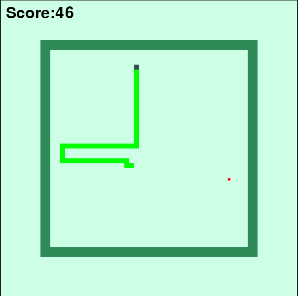

# Snake-Game

This project implements the classic Snake Game in Python, featuring two main modes: manual play and Reinforcement Learning (RL) training/evaluation.
The game engine defines the grid, snake, apple, and rules.
The environment exposes observations and rewards, and the agent handles decision-making and the training/evaluation loop.

## Gameplay Preview

Below is a short preview of the game in action:



## Requirements
- python 3.10+


## Installation

From the project root, install the dependencies listed in `requirements.txt`:

```bash
python -m venv .venv
source .venv/bin/activate   # On Windows: .venv\Scripts\activate
pip install --upgrade pip
pip install -r requirements.txt
```

## How to Run

### Manual Game Mode

To play manually, run the game module located in the `src/` folder:

```bash
python src/snack.py
```

### Reinforcement Learning Mode

To train or evaluate the RL agent, run the training module:

```bash
python src/agent.py
```

## Game Logic

The game runs on a grid. Each “tick,” the snake moves one cell in its current direction.
Eating an apple increases the snake’s length and spawns a new apple in a free position.
The game ends if the snake hits its body or the borders.

In RL mode, the environment provides observations and rewards, guiding the agent to maximize its score.


## Contributing

Contributions are what make the open source community such an amazing place to be learn, inspire, and create. Any contributions you make are greatly appreciated.

- Fork the Project

- Create your Feature Branch (git checkout -b feature/AmazingFeature)

- Commit your Changes (git commit -m 'Add some AmazingFeature') Push to the Branch (git push origin feature/AmazingFeature)

- Open a Pull Request


## License

This project is distributed under the [MIT](LICENSE) License.
